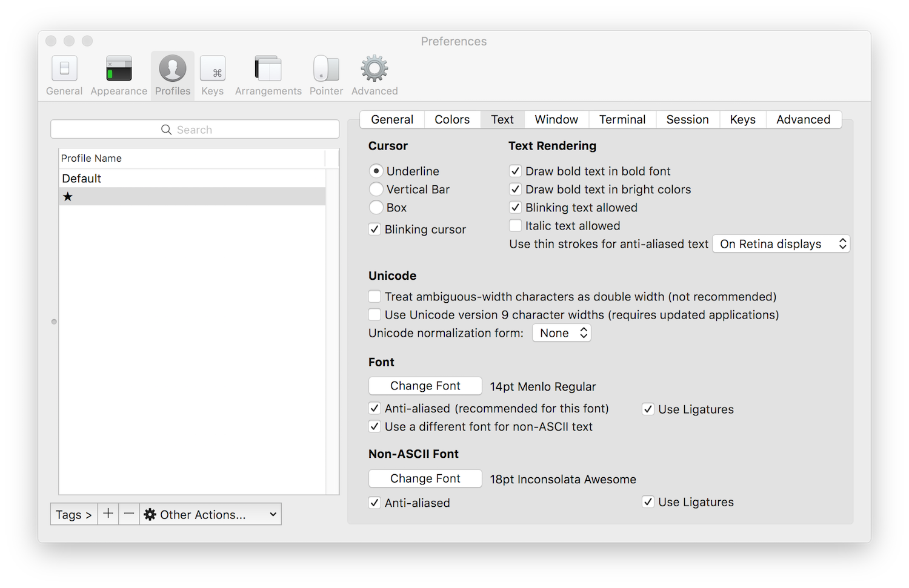

# My dotfiles repo

I use [Homesick](https://github.com/technicalpickles/homesick) to manage my dotfiles.  I began with Nate McCurdy's dotfiles and expanded them to support my own use.

## (Mostly) Auto bootstrap of a new mac

Change the `HOSTNAME` environment variable to be whatever you want. Or leave it out to not change the default computer name.

```
curl -O https://raw.githubusercontent.com/cdrobey/dotfiles/master/bootstrap_new_mac.sh && chmod u+x bootstrap_new_mac.sh
HOSTNAME=foo ./bootstrap_new_mac.sh
```

## Manual Installation

### Homebrew

I use [Homebrew Bundle](https://github.com/Homebrew/homebrew-bundle) for most of my application installations

1. Install HomeBrew: `/usr/bin/ruby -e "$(curl -fsSL https://raw.githubusercontent.com/Homebrew/install/master/install)"`
1. Install ruby and mas: `brew install ruby mas`

### ZSH

1. oh-my-zsh: `sh -c "$(curl -fsSL https://raw.githubusercontent.com/robbyrussell/oh-my-zsh/master/tools/install.sh)"`
1. powerlevel9k theme: `git clone https://github.com/bhilburn/powerlevel9k.git  ~/.oh-my-zsh/custom/themes/powerlevel9k`
1. Make the following mod to .zshrc:  `ZSH_THEME='powerlevel9k/powerlevel9k`
1. zsh-autosuggestions: `git clone https://github.com/zsh-users/zsh-autosuggestions.git $ZSH_CUSTOM/plugins/zsh-autosuggestions`
1. zsh-syntax-highlighting: `git clone https://github.com/zsh-users/zsh-syntax-highlighting.git $ZSH_CUSTOM/plugins/zsh-syntax-highlighting`

### Homesick

After completing the homebrew installation of ruby, you must use a hardcoded path until homesick fully configures your shell rc.

1. Install Homesick with `/usr/local/opt/ruby/bin/ruby/gem install homesick`
1. Clone this castle with `homesick clone cdrobey/dotfiles`
1. Create the symlinks with `homesick symlink dotfiles`
1. `/usr/local/opt/ruby/bin/ruby/gem install r10k puppet-lint rubocop`

### Vim plugins

1. [Vim-Plug](https://github.com/junegunn/vim-plug) Install: `curl -fLo ~/.vim/autoload/plug.vim --create-dirs https://raw.githubusercontent.com/junegunn/vim-plug/master/plug.vim`
1. Install Vim plugins: `vim +PlugInstall +qall`

### Colors and Fonts

GruvBox iTerm2 color scheme. Download it, open it, then set it as your profile's color scheme: <https://github.com/morhetz/gruvbox-contrib/raw/master/iterm2/gruvbox-dark.itermcolors>


I prefer the Powerline Meslo font for iterm2, but you can find many options.
1. Download and and doubleclick to import or move it to `~/Library/Fonts/`
    * <https://github.com/powerline/fonts/blob/master/Meslo%20Slashed/Meslo%20LG%20M%20Regular%20for%20Powerline.ttf>
1. Configure your profile in iTerm2 to use that font for **Non ASCII Font**:



## MacOS Defaults
I scavenged a set of defaults from a series of repositories.  The script exists in CASTLE/home/.bin/osx.shand provides a great starting point for a new mac.

### MacOS Settings and Tweaks

```
homesick cd && HOSTNAME=foo ./home/.bin/osx.sh
```
### Other Mac Applications

Here are some apps from the Apple Store that I use all the time. They're on Homebrew, but I use the App Store versions so that my registration info is automatically setup.

* Amphetamine: <https://itunes.apple.com/us/app/amphetamine/id937984704?mt=12>
## Resources

I originally forked Nate McCurdy's dotfiles for my initial build.  I actively watch the following repositories and add the best changes to this repository:

- [Nate McCurdy dotfiles](https://github.com/natemccurdy/dotfiles)
- [GitHub ❤ ~/](http://dotfiles.github.com/)
- [Mathias’s dotfiles](https://github.com/mathiasbynens/dotfiles)
- [Nicolas Gallagher’s dotfiles](https://github.com/necolas/dotfiles)
- [Cătălin’s dotfiles](https://github.com/alrra/dotfiles)
- [Paul's dotfiles](https://github.com/paulirish/dotfiles)
- [Jacob Gillespie’s dotfiles](https://github.com/jacobwg/dotfiles)

